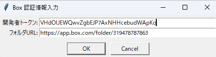

# Box Photo Geo URL

Boxのフォルダ内の画像ファイルを取得し、EXIF情報から緯度経度・撮影日を抽出し、共有リンク付きで一覧化・GPKG/CSV出力するPythonスクリプトです。

## 特徴

- Box APIで指定フォルダ（サブフォルダ含む）内の画像ファイルを再帰的に取得
- 画像のEXIF情報から緯度・経度・撮影日を抽出（JPEG/TIFF/HEIC対応）
- 画像ごとにBoxの共有リンク（Web URL）を付与
- 結果をCSVおよびGPKG（QGIS対応）で出力
- QGISで「url」列を使ってアクションやHTMLポップアップで写真表示が可能

## 必要なライブラリ

```sh
pip install boxsdk requests Pillow exifread geopandas shapely pandas pillow-heif
```

## 使い方



1. `config.json` を同じフォルダに用意し、Boxの `開発者トークン` を記載してください（初回起動時にGUIで入力も可能）。
2. スクリプトを実行します。

```sh
python box_photo_geo_url.py
```

3. GUIで `開発者トークン` と `フォルダURL` を入力します（`config.json` に保存されます）。
4. 指定フォルダ以下の画像ファイルを再帰的に取得し、EXIF情報から位置情報・撮影日を抽出します。
5. 結果が `box_photos.csv`（CSV）と `box_photos.gpkg`（GPKG）として出力されます。

## EXEファイルについて

[`box_photo_geo_url.py` を PyInstaller でビルドした EXE ファイルはこちらから。](https://1drv.ms/u/c/cbbfeab49e70546f/EeZQjitMDHNGjaakVGEF29oBSy0etNC6dOX0AadLIhgnEg?e=UiXQdY)  
Python環境がなくても、Windows上で `box_photo_geo_url.exe` を直接実行できます。

- EXEの作成コマンド例:
  ```
  pyinstaller --onefile --noconsole box_photo_geo_url.py --hidden-import=boxsdk.object.recent_item
  ```
- 必要に応じて `config.json` などの設定ファイルも同じフォルダに配置してください。

## 出力ファイル

- `box_photos.csv`  
  画像ファイル名、パス、緯度、経度、撮影日、Box共有URLを含むCSV
- `box_photos.gpkg`  
  QGIS等で利用できるジオパッケージ（EPSG:4326、url列付き）

## QGISでの利用例

- 「url」列をQGISの「アクション」や「HTMLポップアップ」で利用し、写真をWeb表示できます。
  - 例: アクションに `[% "url" %]` を設定しWebブラウザで画像を開く
  - 例: HTMLポップアップに `` など

## 注意事項

- 画像のEXIF情報は画像ファイル自体に埋め込まれているため、**画像をダウンロードせずにEXIF情報を取得することはできません**。
- Box APIは画像のメタデータとしてEXIF情報を直接返すエンドポイントを提供していません。
- EXIFのGPS情報はWGS84（EPSG:4326）を前提としています。
- `access_token` の有効期限切れ時は再取得が必要です。

## 参考

- [Box API ドキュメント](https://developer.box.com/guides/authentication/oauth2/)
- [QGIS アクション/HTMLポップアップ](https://docs.qgis.org/ja/docs/user_manual/working_with_vector/actions.html)
